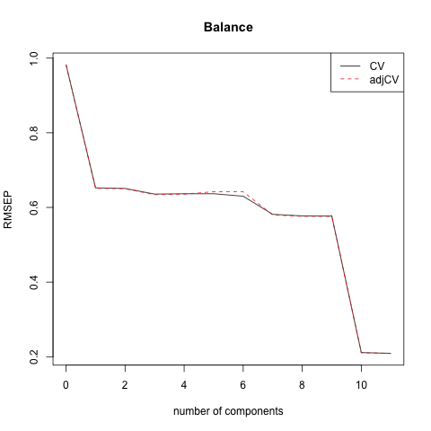

## Project Objective
This project thoroughly explores the predictive modeling process. From previous study, in order to understand the relationship of one dependent variable with several independent variables, we fit a multiple linear regession with Ordinary Least Squares. However, since OLS may have high variance and include irrelevant variables, Predictive Modeling Process can improve the results in terms of **Prediction Accuracy** and **Model Interpretability**. 

## Data Target
Our analysis starts with the data set [Credit](http://www-bcf.usc.edu/~gareth/ISL/Credit.csv) provided by the author of book "An Introduction to Statistical Learning". This data set records `Balance`, which is the average credit card debt for a number of individuals, as well as several predictors. The dataset has eleven variables:

<div class="blue">
- Seven **quantitative** variables: Income, Limit, Rating, Cards, Age, Education, and Balance
- Four **qualitative** variables, Gender, Student, Married, and Ethnicity
</div>

Our goal is to understand the relationship between `Balance` and these potential predictors with statistical fitting procedures.


## Methodology and Applied Methods

Instead of fitting multiple linear regression with ordinary least square (OLS), we use OLS as a benchmark to compare the following four methods: 

- **Shrinkage Methods**
    - Ridge regression (RR)
    - Lasso regression (LR)
- **Dimension Reduction Methods**
    - Principal Components regression (PCR)
    - Partial Least Squares regression (PLSR)

## Key Findings

We can first explore the relationship of each predictors by creating a scatterplot matrix among all variables.

After the initial observations, we fit the four different regression methods and observe the trend of lambda for ridge regression and lasso regression

## Key Findings - Scatterplot


## Key Findings - Lasso Lambda


## Key Findings - Ridge Lambda


## Key Findings - PLSR


## Key Findings - PCR



## Key Findings - Mean Squared Error

We can also observe and table the Mean Squared Error obtained from each regression method

```{r, echo=FALSE}
library(xtable)
load("../data/pcr.Rdata")
load("../data/ols.Rdata")
load("../data/plsr.Rdata")
load("../data/ridge.Rdata")
load("../data/lasso.Rdata")
load("../data/report.Rdata")
```

```{r, echo=FALSE, results='asis', message=FALSE}
# Create table of test MSE
library(knitr)
library(reshape2)
library(ggplot2)
table_mse <- data.frame("Ridge" = model.ridge.mse,
                        "Lasso" = model.lasso.mse,
                        "PCR" = model.pcr.mse,
                        "PLSR" = model.plsr.mse)
rownames(table_mse) <- "MSE Value"

# Print table of test MSE
kable_table_mse <- kable(table_mse,
                         caption = "Display: Mean Squared Errors",
                         digits = 5)
print(kable_table_mse, caption.placement="top")
```

## Coefficients

```{r, echo=FALSE, results='asis'}
# Coefficient table for plsr
# colnames(model.plsr.coeff) <- c("Value")
xtable_plsr_coef<- xtable(coeff_table, 
                         caption = 'Coefficient Table')
print(xtable_plsr_coef, comment=FALSE, type = "latex", caption.placement = 'top')
```

```{r, echo=FALSE}

plot_table_coef <- cbind(data.frame("Predictors" = rownames(coeff_table)), coeff_table)
rownames(plot_table_coef) <- NULL

plot_table_coef <- melt(plot_table_coef, id.vars = "Predictors" , value.name= "Coefficients", variable.name= "Models")

ggplot(plot_table_coef, aes(x = Predictors, y=Coefficients, group = Models, colour = Models)) +
    geom_line() +
    geom_point(size = 1) +
    ggtitle("Figure 5: Official Coefficients Comparison") + theme_bw() + 
    theme(axis.text.x = element_text(angle = 45, hjust = 1))
```


## Conclusions

In conclusions, we explore and compare the usage of different regression models on dataset `Credit` to understand the relationship between dependent variable `Balance` and ten potential predictors. Setting ordinary least squares as the benchmark, we look at two shrinkage regression methods (ridge and lasso) and two dimension reduction regression methods (PCR and PLSR) to find the best fitting model.

## Reference

James, Gareth, Daniela Witten, Trevor Hastie, and Robert Tibshirani. _An Introduction to Statistical Learning: With Applications in R_. New York: Springer, 2013. Print.

1. https://en.wikipedia.org/wiki/Partial_least_squares_regression

